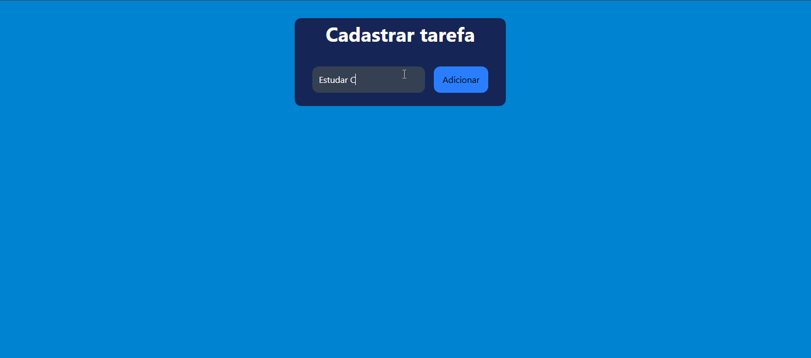

# 📝 To-Do List

⚙️📒 Projeto pessoal sendo desenvolvido para aprimorar minhas habilidades em novas tecnologias.

## Sobre o Projeto

Trata-se de uma **To-Do List** que começou como um projeto em **C# para terminal** e evoluiu para uma versão **web**, sendo construída com **React** e **TailwindCSS**.

O objetivo é aplicar conhecimentos de **desenvolvimento Full Stack**, adicionando funcionalidades gradualmente, com **integração de backend via API** e **persistência de dados** em breve.

## Estrutura e funcionalidades atuais do projeto.

- Criar, listar, concluir e excluir tarefas (versão de terminal (pasta "backend").

- Interface em React e estilizada com TailwindCSS (pasta "frontend") integrado com o backend via minimal API e endpoints. (pasta "backendAPI"). Com funcionalidades de Criar, listar, editar, concluir, reverter conclusão e excluir tarefas.

## Demonstração

---
